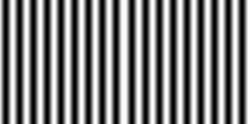
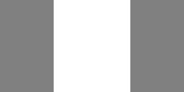
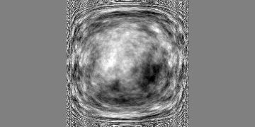
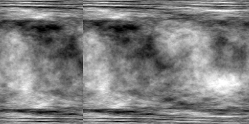
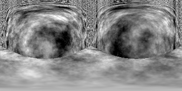
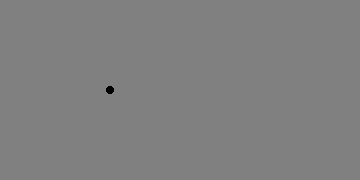
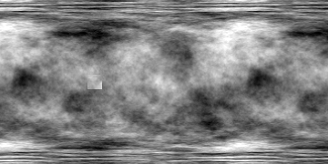
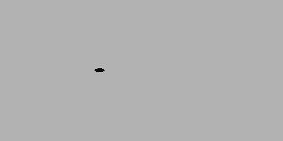
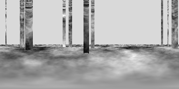

# Cases

Thirteen cases in six categories. Every case varies one physical parameter over at least six values, and every variant
is rendered for both eyes with exact ground truth (depth along each ommatidium's ray, object masks, optic flow, time to
contact). Splits for the learned readouts group by scene layout and stimulus seed, so no layout or seed reaches both
train and test. One page per case is added to `cases/` when the case is built.

| Category | Case | Varied parameter | Why it exists |
|---|---|---|---|
| Motion primitives | C01 gratings | temporal frequency (8 directions each) | direction selectivity, optomotor drive |
| | C02 moving edges | speed (ON and OFF, 8 directions) | the ON and OFF pathways, T4 versus T5 |
| | C03 flashes | contrast | polarity of the lamina and medulla |
| Looming and collision | C04 looming disc | size-to-speed ratio l/v | LPLC2 and LC4 to the giant fibre, the escape |
| | C05 receding disc | l/v | negative control for C04 |
| | C06 wall approach in flight | approach speed | time to contact, depth |
| Self-motion | C07 yaw rotation | angular velocity | optomotor response; depth is unobservable (a control for the parallax readouts) |
| | C08 corridor translation | forward speed | depth from parallax |
| Objects and figure-ground | C09 small target | target size | the small-object channel (LC11) |
| | C10 figure over ground | relative speed | segmentation by relative motion |
| Social and natural | C11 rival fly | trajectory | LC10 and courtship pursuit, a known gap of the raw wiring |
| | C12 natural flights | scene and path | everything together, on natural image statistics |
| Controls | C13 dark and static | luminance, duration | spontaneous activity; nothing should move |

## The scenes, as the fly's eyes see them

One panorama per case (`scripts/case_gallery.py`): the middle stimulus of the case at half its duration, 360 by 180
degrees, straight ahead at the centre and the fly's left on the left.

| | | |
|---|---|---|
|  C01 gratings |  C02 moving edges |  C03 flashes |
|  C04 looming disc |  C05 receding disc |  C06 wall approach |
|  C07 yaw rotation |  C08 corridor |  C09 small target |
|  C10 figure over ground |  C11 rival fly |  C12 natural flights |
|  C13 dark and static | | |

## The variants

| Case | Varied parameter and its values | Also varied | Stimuli | Duration each |
|---|---|---|---|---|
| C01 | temporal frequency: 0.5, 1, 2, 4, 8, 16 Hz (wavelength 20 degrees) | 8 directions | 48 | 0.6 s |
| C02 | speed: 30, 60, 90, 120, 180, 240 degrees per second | 8 directions, ON and OFF | 96 | 80 degrees of sweep |
| C03 | contrast: -1, -0.6, -0.3, 0.3, 0.6, 1 (from 0.1 to 0.4 s) | | 6 | 0.7 s |
| C04 | l/v: 10, 20, 40, 60, 80, 120 ms (radius 1 cm, 60 degrees to the left, contact at 0.8 s) | | 6 | 0.78 s |
| C05 | l/v: the same, receding from 1.5 radii | | 6 | 0.8 s |
| C06 | flight speed toward a textured wall: 0.1 to 1 m/s | texture seed | 6 | 0.8 s |
| C07 | yaw rate in a textured drum: 30 to 500 degrees per second | texture seed | 6 | 1 s |
| C08 | flight speed down a 20 cm textured corridor: 0.1 to 1 m/s | texture seeds | 6 | 1 s |
| C09 | target size: 2, 3, 5, 8, 12, 20 degrees, crossing the left eye at 100 degrees per second | | 6 | 1 s |
| C10 | speed of a textured 4 cm square over textured ground: 10 to 180 degrees per second | texture seeds | 6 | 0.8 s |
| C11 | a fly-sized ellipsoid on six seeded courtship-like paths, 6 to 15 mm away | | 6 | 1.5 s |
| C12 | six seeded forests of textured trunks over textured ground, each with its flight path | | 6 | 1.5 s |
| C13 | uniform luminance: 0, 0.1, 0.3, 0.5, 0.7, 1 | | 6 | 1 s |

Directional stimuli (C01, C02) are mirror-symmetric: each eye sees the pattern in its own local frame (0 degrees front
to back, 90 up, around the eye's centre at 72.5 degrees of azimuth), so a direction of 0 is progressive motion on
both eyes at once, and the direction a T4 or T5 cell prefers can be read on either eye. Textures are laid so one
texel spans about a degree at the case's viewing distance; finer texture would alias under the ommatidia's sampling.

## The renderer

Every surface has a closed-form intersection with a ray ``o + s d``, so depth, the object hit and the hit point are
exact. A sphere of centre ``c`` and radius ``r``: the smallest positive root of

$$\lVert o + s\,d - c \rVert^2 = r^2 ,$$

an ellipsoid the same after scaling by its semi-axes in its own turning frame; a plane of normal ``n`` through ``q``:
``s = (q - o) \cdot n / (d \cdot n)``, cut to its extent; the inside of a vertical cylinder of radius ``R`` (the
panorama): the far root of ``(o_x + s d_x)^2 + (o_y + s d_y)^2 = R^2``. The nearest positive hit over all surfaces is
what the ray sees; nothing hit is the sky.

**What an ommatidium sees** is its acceptance applied to the scene. The acceptance is a Gaussian of full width at half
maximum 8.23 degrees (R1-R6, dark-adapted; Gonzalez-Bellido, Wardill and Juusola, *PNAS* 108:4224, 2011,
doi:10.1073/pnas.1014438108), so ``sigma = 8.23 / 2.355 = 3.5`` degrees. It is integrated with 19 rays: the axis,
6 rays at one sigma and 12 at two sigma around it, weighted by the Gaussian and normalised:

$$L_i = \sum_{k=1}^{19} w_k\, L(d_{ik}), \qquad w_k \propto e^{-\rho_k^2 / 2\sigma^2},\quad \rho_k \in \{0, \sigma, 2\sigma\}.$$

**The truth** comes from each ommatidium's axis: the depth ``s``; the object; the optic flow, the angular velocity of
the hit point in the fly's body frame, from the same material point half a frame before and after (surfaces move with
their object, the sky is fixed in the world, and the fly's own turning is included); and the time to contact, the
distance over the closing speed where the point approaches. Checked against closed forms: a fly turning at
``omega`` sees every equatorial ommatidium's scene move at ``-omega``; a sphere approaching at ``v`` has time to
contact ``(d - r) / v`` and angular size ``2 atan(r / d)``.

**Output.** Each stimulus is a directory in the compiled format of `flycns` (a manifest with the SHA-256 of every
array): per frame (200 per second) and eye column, the luminance (as 16-bit integers, a step of 1.5e-5), depth,
object, flow and time to contact; per frame, the luminance at the 721 columns of flyvis's lattice on each eye (the
input of engine E3). `index.json` lists every stimulus with its case, parameter, seed, layout and split.

## Splits

The learned readouts train on the train split only. A split is a function of the scene layout (a hash of its id):
60% train, 15% validation, 10% calibration, 15% test. Variants that share a texture seed share a layout, so no layout
reaches two splits.
